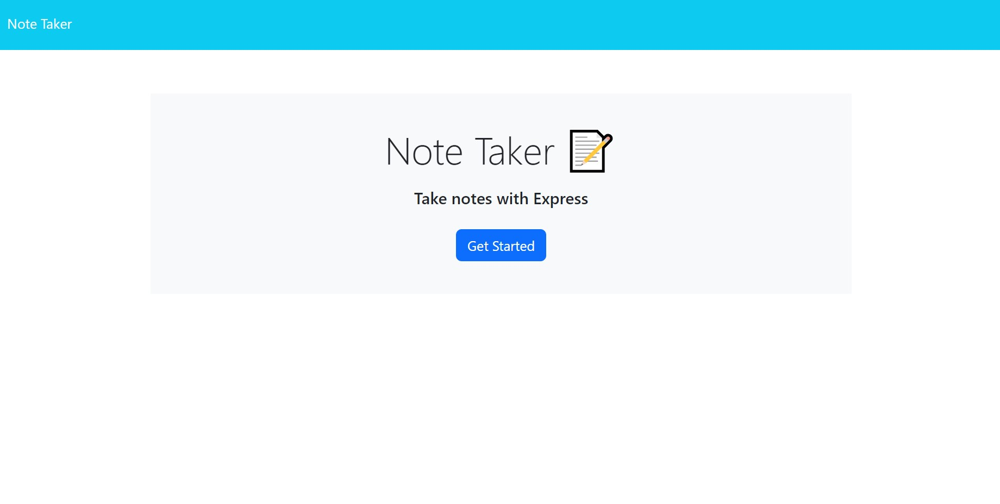
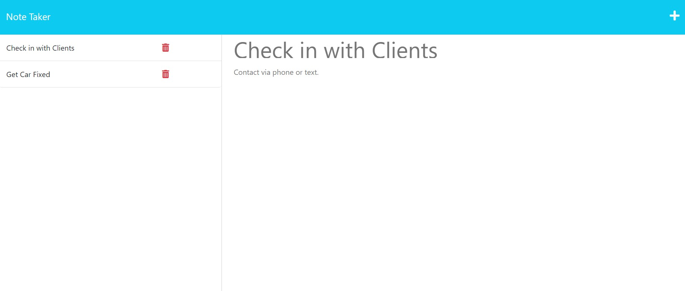

# Note Taker App

## Description

With this straightforward application, you can create note entries effortlessly. Each entry comprises a title and its corresponding text. Once you have inputted a title and message, a save icon will become visible. By clicking on this icon, the note will be saved. The left column will display all of the saved note entries, and you can view their content by simply clicking on them. Additionally, if you wish to remove any entry, you can do so by clicking on the red trashcan icon located next to each entry.

By developing this application, I gained a deeper understanding of Express.js and acquired knowledge of various new concepts. It provided me with an opportunity to enhance my skills in handling GET and POST requests, as well as configuring an Express.js application to serve static files. Additionally, I gained insights into the relationship between client-side requests and server-side responses. Moreover, I expanded my knowledge by exploring the deployment process using Heroku, which offers more capabilities compared to GitHub which is limited to hosting static webpages without supporting server-side processing.

## Table of Contents
1. [Installation](#installation)
2. [Usage](#usage)
3. [Credits](#credits)
4. [Questions](#questions)  
5. [License](#license)

## Installation
- Download and install the Node.js LTS version from [Node.js](https://nodejs.org/en).
- Clone the repo using:

        git clone git@github.com:Dinh282/note-taker.git

- Or download the code from https://github.com/Dinh282/note-taker.git and
open it with VS Code.
- Make sure you are in the root path of the project folder and then install dependencies for the project with:

        npm i

- You would also need to download and install Insomnia from https://insomnia.rest/download to run the server from your local machine.

## Usage

- After completing all of the installations, you can run the application with the following command from the terminal of VS Code:

        node server.js

- After running the command, you should see "App listening at http://localhost:3001" in the terminal. You can Ctrl + Click the link or copy and paste it into your web browser to use the application.
- From the home page, you can click on the "Get Started" button to be taken to the Notes page to create, view, and delete any notes you no longer need.

- Alternatively, you can access the functional, deployed application at: 

---

Video Demo of Application:

 Screenshots of Note Taker App:

## Credits:

1. https://expressjs.com/en/starter/basic-routing.html (Help with express (Routing))

2. https://www.youtube.com/watch?v=-MTSQjw5DrM (Help with RESTful API)

3. https://www.youtube.com/watch?v=-mN3VyJuCjM (Help with RESTful API)

4. https://www.youtube.com/watch?v=lsMQRaeKNDk (Help with RESTful API)

5. https://developer.mozilla.org/en-US/docs/Web/JavaScript/Reference/Global_Objects/Array/filter (Help with filter method.)

6. https://www.npmjs.com/package/uuidv4 (Help with uuidv4).

7. https://www.youtube.com/watch?v=SccSCuHhOw0&t=930s (Help with Express.js) 

8. https://docs.insomnia.rest/insomnia/get-started#:~:text=Insomnia%20is%20an%20open%20source,code%20generation%2C%20and%20environment%20variables. (Help with using Insomnia)

9. Instructor, TAs, and classmates.

## Questions
Feel free to contact me at nguyen_dinh282@yahoo.com for additional information.  
Also, check out my other projects on [GitHub](https://github.com/Dinh282)

## License

Please refer to the LICENSE section in the repository.

---